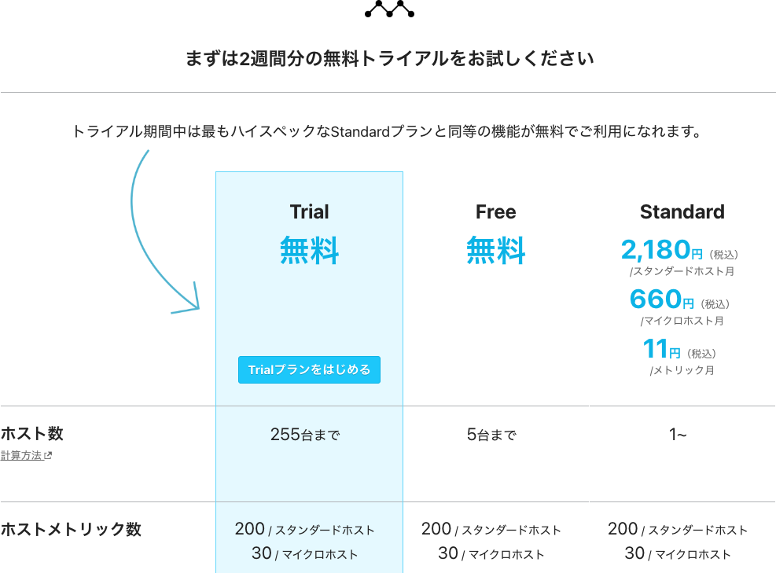
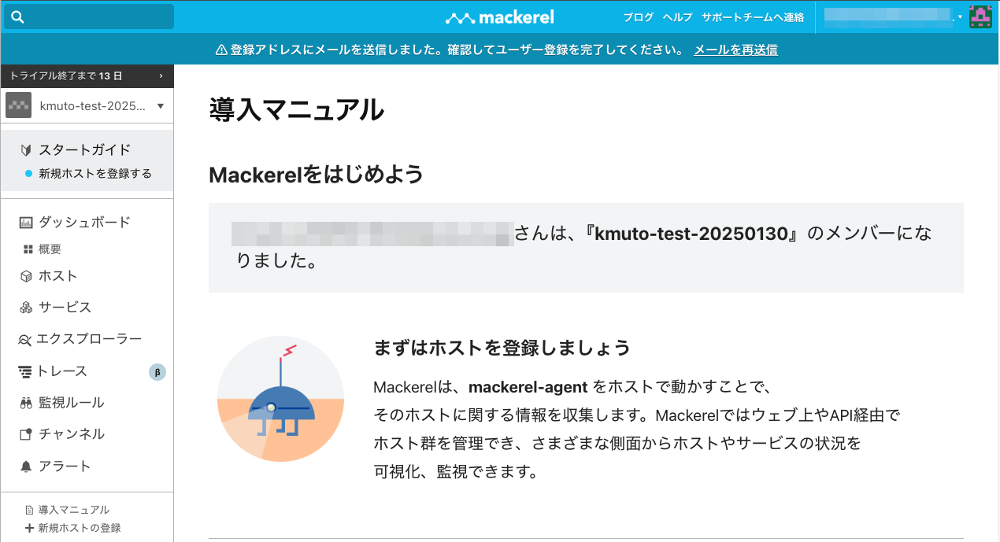
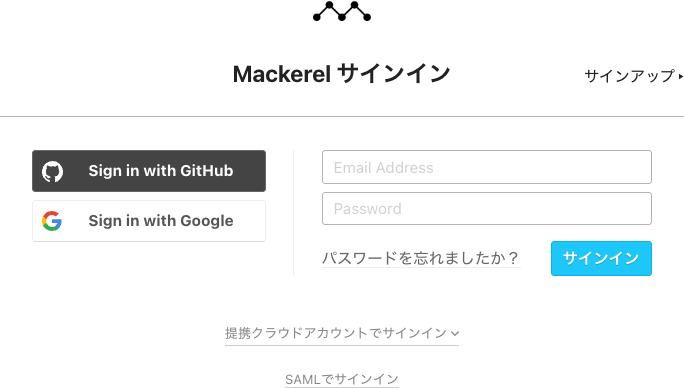
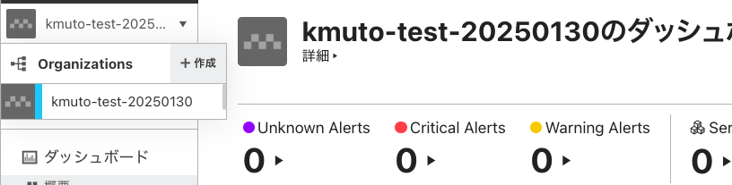

[←「このハンズオンを始める前の準備」へ戻る](../01-prepare/README.md)

# Mackerelを使うための準備

このハンズオンでは、分散トレーシングを体験いただくために、私たちのSaaS型オブザーバビリティプラットフォーム「[Mackerel](https://ja.mackerel.io)」を利用します。

そのため、Mackerelへユーザー登録するサインアップ、または既存のユーザー情報を使ったサインインと、分散トレーシングの投稿先となるオーガニゼーションの作成が必要です。既存のオーガニゼーションをお持ちであれば、それを利用しても構いません。

- Mackerelにユーザー登録することでの課金は一切発生しません
- 皆さんのメールアドレスがそのままユーザー名となります。お使いのコンピュータでメール内容を参照できるメールアドレスをご用意ください

## Mackerelへのサインアップ

はじめてMackerelをご利用の場合は、[Mackerelサインアップ](https://mackerel.io/signup)から、アカウントの作成（サインアップ）を行ってください。

メールアドレス欄に有効なメールアドレスを記入し、「利用規約に同意する。」と「成人している。もしくは未成年者の場合、親権者の同意を得ている。」の2つを確認の上でチェックボックスをクリックして、「サインアップ」をクリックします。

次に、オーガニゼーションを作成します。

> [!NOTE]
> オーガニゼーションは「組織」を表す概念で、Mackerelの契約の単位となります。ユーザーアカウントは、1つ以上のオーガニゼーションに所属でき、付与された権限に応じて、オーガニゼーションの閲覧、更新などを行うことができます。

オーガニゼーション名を指定します。オーガニゼーション名には、3文字以上63文字以下の英数字およびハイフンを利用できます。

> [!NOTE]
> オーガニゼーションの名前はMackerel全体で一意である必要があります。自社名やサービス名などでの取得にはご注意ください。

さらにアンケートとしてお名前、個人・法人のどちらの利用か、想定利用台数、法人の場合は会社名・業種・従業員数・役割やご連絡先電話番号などの質問も提示されます。差し支えない範囲で記入し、「作成」ボタンをクリックして先に進んでください。

> [!NOTE]
> これはあくまでもアンケートで、個人・法人でプランや機能に違いが発生することはありません。

次にプランの選択画面が表示されます。新しく作成するオーガニゼーションには、2週間のトライアル期間が設定されており、Mackerelのすべての機能を期間中無料で利用できます。「Trialプランをはじめる」をクリックしてください。**トライアルではクレジットカード等を登録する必要なく、期間終了後はFreeプランに切り替わりますので、終了後に突然課金されるような心配はありません。**

これで、作成したオーガニゼーションが開きます。

この状態では、ユーザー登録がまだ完了していません。登録したメールアドレス宛てに「`[Mackerel] Please verify your email`」という件名のメールが届くので、メール本文に記載されているURLを開いて、パスワードの登録を完了しておいてください。

> [!IMPORTANT]
> Mackerelへのサインアップおよびオーガニゼーションの作成ができましたか？

> [!IMPORTANT]
> Mackerelユーザーのパスワードの設定は済みましたか？

**オーガニゼーションの用意ができたら、ハンズオンに臨む準備は完了です！** よろしければぜひMackerelのいろいろな機能を試してみてください。

## すでにMackerelのユーザーアカウントをお持ちの場合

すでにMackerelのユーザーアカウントをお持ちであれば、[Mackerelサインイン](https://mackerel.io/signin)から、メールアドレスとパスワードを使ってサインインできます。

既存のオーガニゼーションをこのハンズオンに利用することもできますし、画面左上にあるオーガニゼーション切り替えメニューの▼ボタンから「＋作成」をクリックして、新しいオーガニゼーションを作ることもできます。

> [!NOTE]
> 既存のオーガニゼーションをこのハンズオンに利用する場合、そのオーガニゼーションのオーナーまたは管理者の権限を持っている必要があります。権限を保有していない場合は、新しいオーガニゼーションを作成すれば、そのオーガニゼーションのオーナーになることができます。

> [!NOTE]
> 新しく作成したオーガニゼーションは、Trialプランから始められます。

なお、Mackerelの分散トレーシング機能は、現時点で無料でどなたでも利用できます。Freeプランでも分散トレーシング機能は利用可能です。

> [!NOTE]
> 送信するトレース・スパンの量には制限があります。

> [!IMPORTANT]
> サインインできていて、オーナーまたは管理者権限のあるオーガニゼーションを用意できましたか？

では、ハンズオンを始めましょう！

[→「分散トレーシングとは」へ進む](../03-distributedtracing/README.md)
