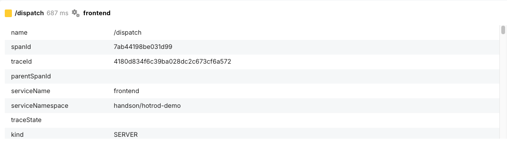
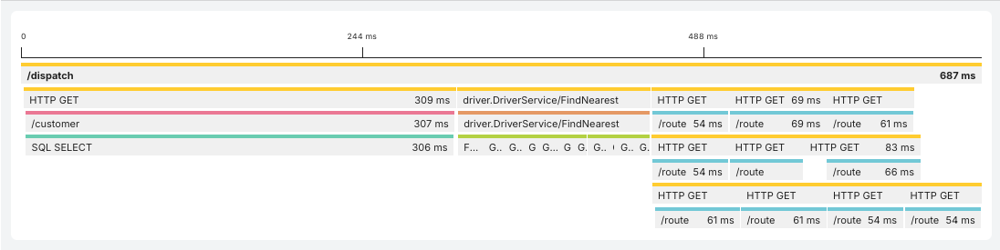
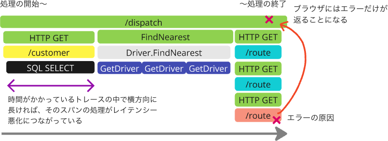

[←「Mackerelを使うための準備」へ戻る](../02-mackerelsetup/README.md)

# 分散トレーシングとは

## 誕生の背景

クラウドやコンテナ、疎結合なマイクロサービスといったテクノロジーの発展により、現代のアプリケーションは弾力性・可用性・耐障害性を高めていますが、その一方で複雑性ははるかに増しています。

従来のホスト個々の負荷状況の監視よりも、**ユーザー体験**から見たサービスとしての状況の把握・可観測性が重視されるようになっています。

しかし、アプリケーションの構成の複雑化で、**異常**が発生したことは検知できても、なぜそれが起きたか？の**原因**を探るのは困難になりがちです。

- 従来のログ記録は、原因となる詳細データを探すには適していますが、保存や検索など高いコストがかかります。サービス間の関係性もわかりません
- 数値化されたメトリックのような時系列データは、保存コストが低く、症状を素早く見てとることはできますが、原因の特定にはつながりません

1日に万・億単位のサービス間呼び出しが発生する現代のアプリケーションサービスにおいては、障害やボトルネックを検出するために別の手段が必要です。

そうして誕生したのが、**分散トレーシング**という技術です。

> [!NOTE]
> 歴史的には、Google社が自社の大規模なマイクロサービスの挙動を追跡できるよう開発・運用の実績を積み、論文として2010年に発表された**Dapper**にさかのぼります（[Dapper, a Large-Scale Distributed Systems Tracing Infrastructure](https://research.google/pubs/dapper-a-large-scale-distributed-systems-tracing-infrastructure/)）。この論文をもとに、OSSとしてZipkin（旧Twitter社）、Jaeger（Uber社）が開発されました。

## 分散トレーシングの仕組み

**分散トレーシング**は、複数のサービスやコンポーネントにまたがるリクエストを収集し、システム内をどのように流れているかを可視化します。これにより、どこでエラーが発生したか、どこで時間がかかって遅くなっているかを素早く特定できます。

分散トレーシングの基本概念となるのが、**トレース**と**スパン**です。

**トレース**は、1つのリクエストあるいはトランザクションの全体の流れを記録したものです。たとえばWebサーバーが1つリクエストを受け取って、処理し、ブラウザにレスポンスを送るまでを1つのトレースとして表すことができます。

トレースは、1つ以上の、**スパン**と呼ばれるセグメントで構成されます。

**スパン**は、個別の処理単位です。例として以下のようなスパンがあります。

- フロントエンドがリクエストを受け取る処理
- ユーザー認証を行う処理
- データベースにクエリを送って結果を取得する処理
- レスポンスをクライアントに返す処理

スパンには各種の情報が**属性**と**値**として格納されています。

- トレースID、サービス名、開始時刻、終了時刻、処理にかかった時間
- 階層構造の情報。子スパンから親スパンを指定することで、親子関係を構成できます
- 操作の名前、ホスト情報、データベースクエリ文字列、エラーログなど

スパン1つひとつは小さなログデータですが、それを大量に収集しなければならない性質上、人間が通常のログのように読むことはほぼ不可能です。スパンを受け付けて、親子関係を組み立て、トレースとしてビジュアライズするのは、**分散トレーシングツール**（JaegerやMackerelなど）の役割です。

これはMackerelのトレース表示画面です。

- それぞれの色付きのボックスがスパンを表します
- このトレース内では複数のサービス間で通信をしていますが、同じサービス名のものは同じ色で示されています
- 右方向に時間が経過します。よって、横方向は直列的な処理の実行です
- 縦方向は同時刻に発生していることを意味します。よって、縦方向は並列的な処理の実行です
- スパンの親子関係が存在する箇所では、スパンの親は上側、子は下側に配置されます

サービスやコンポーネントによってトレースの形式が違ってしまうと、それを処理する分散トレーシングツールで困ってしまいます。

ユーザーにとっても、一社の分散トレーシングツールのデータ形式に縛られてしまうのは、いわゆるベンダーロックインの状態になり、身動きが取りづらくなります。

そのため、**OpenTelemetry**という事実上の標準規格（デファクトスタンダード）を採用するのが主流となりつつあります。OpenTelemetryについては後で説明します。

> [!NOTE]
> OpenTelemetryは、OpenTracingとOpenCensusという分散トレーシングを主導する2つのプロジェクトが統合して生まれました。

## 分散トレーシングを使った原因調査

たとえばWebアプリケーションサービスのユーザー体験として、「挙動が遅い」「ブラウザにエラーが返る」という問題があったとします。

メトリックのレイテンシーグラフやエラー率グラフを見れば、「レスポンスタイムが全体に悪化している」「エラーの数が有意に増えている」といった**異常**はわかります。しかし、**なぜ**そうなったのかはわかりません。

これに対し、分散トレーシングでは**原因**がわかる……少なくとも近づくことはできます。スパンには属性と値が情報として格納されていると前述しました。この情報を分散トレーシングツールで利用し、以下を実現できます。

- 時間がかかっている、すなわちレイテンシーが大きい箇所がわかります
- エラーを含むスパンから発生元へたどりつけます

次のステップでは、トレースなどの標準規格を定めるOpenTelemetryについて、簡単にご紹介します。

[→「OpenTelemetryとは」へ進む](../04-opentelemetry/README.md)
