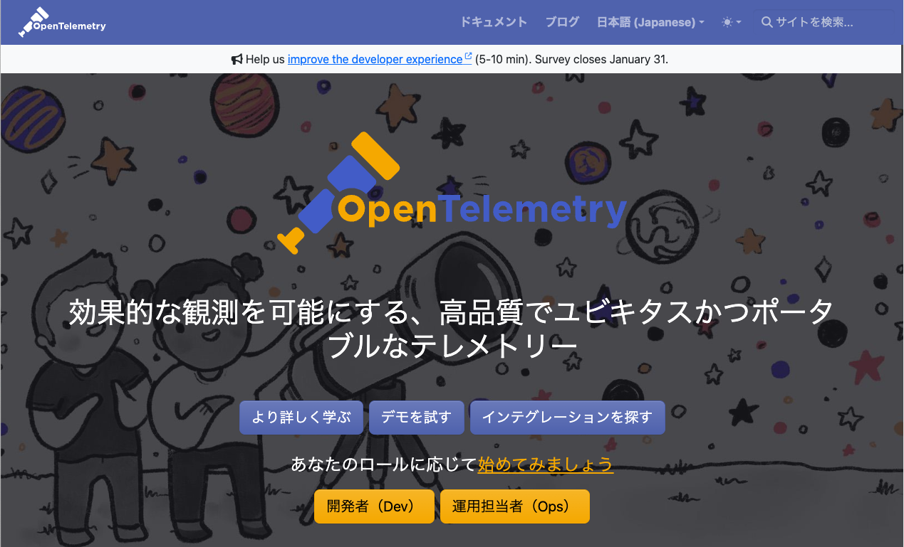

[←「分散トレーシングとは」へ戻る](../03-distributedtracing/README.md)

# OpenTelemetryとは

トレースの形式について、「OpenTelemetryという事実上の標準規格（デファクトスタンダード）を採用するのが現在は一般的です」と前述しました。

**OpenTelemetry**（[https://opentelemetry.io/ja/](https://opentelemetry.io/ja/)）は、テレメトリーの**シグナル**の仕様の事実上標準、およびそれを定めているプロジェクトのことです。

クラウドベンダーやソフトウェアベンダーが参加する非営利団体[CNCF](https://www.cncf.io/)（Cloud Native Computing Foundation）支援のプロジェクトとして、オープンソース、ベンダーニュートラルを掲げ、活発に活動しています。

> [!NOTE]
> CNCFはLinux Foundationの傘下で設立され、「クラウドネイティブコンピューティングをユビキタスにすること」を使命として、クラウドネイティブなアプリケーションやインフラストラクチャの開発を支援するエコシステムの構築を推進しています。コンテナオーケストレーションとして有名なKubernetesも、CNCFのプロジェクトとして支援を受けてきました。

アプリケーションやシステムが何をしているか観測するために情報を収集するプロセスや手法を、**テレメトリー**と呼びます。

そのテレメトリーをどのような形で扱うかのデータの種類、および観測対象のデータそのものが、**シグナル**です。

代表的なシグナルとしてよく挙げられるのは、以下の3つです。

- メトリック
- ログ
- トレース

> [!NOTE]
> ほかには、コードの実行に関する詳細なパフォーマンスデータである「プロファイル」が代表的なシグナルに加わることもあります。OpenTelemetryでもプロファイルのサポートを進めることがアナウンスされています。

## シグナルと相互交換性

**メトリック**（**メトリクス**）は、システムやアプリケーションのパフォーマンスや状態を数値化し、定期的に収集した時系列データです。たとえばCPUやストレージの使用率、リクエスト数などです。

**ログ**は、特定の時点で発生したできごとやメセージを記録した（主にテキストの）データです。エラーメッセージやデバッグ情報などが代表的です。

**トレース**は、説明してきたとおり、リクエストやトランザクションの流れを可視化するためのデータです。

OpenTelemetryは、これらのシグナルについて、統一した形式を定義しています。

- メトリックとトレースといった異なるシグナル間でも情報を結び付けることができます。これにより、より多角的に状態を観測できます
- OpenTelemetryは、ビジュアライズやモニタリングの方法については規定しません。それらは各**オブザーバビリティサービス**、たとえば私たちMackerel、もしくはNew RelicやDatadog、Honeycombといった製品、あるいはオープンソースソフトウェアなどに委ねられます
- 標準化されていることで、アプリケーションを大きく変更することなく、シグナルの出力先を別のツールに容易に切り替え可能です

> [!NOTE]
> 現時点ではMackerelのmackerel-agentやmackerel-container-agent、それにクラウドインテグレーションから投稿されるメトリックは、OpenTelemetryのメトリックと互換性がありません。Mackerelで受け付けたOpenTelemetry形式のメトリックは「ラベル付きメトリック」として扱われ、メトリックエクスプローラーでの可視化や、PromQLによって絞り込んだクエリウィジェットおよびクエリ監視として表されます。

## 計装の方法

アプリケーションのシグナル送出の実装を**計装**（**インストルメンテーション**）と呼びますが、OpenTelemetryでは**ゼロコード計装**と**手動計装**の2種類の方法があります。

**ゼロコード計装**（**自動計装**）は、開発言語向けに用意されているエージェントやOS（カーネル）の機能などを使い、アプリケーションコードに手を加えることなくシグナルを送出する仕組みです（[zero-code instrumentation](https://opentelemetry.io/docs/zero-code/)）。

現時点では、Go、.NET、PHP、Python、Java、JavaScript向けに公式なゼロコード計装の案内が存在します。

ゼロコード計装は開発言語のすべての命令に対応するわけではなく、主に開発フレームワークを前提に、HTTPリクエストや、データベースへのアクセスなどの主要なポイントを計装しています。

> [!NOTE]
> 実際、現代のアプリケーション開発でフレームワークを使わずに進めることは少ないでしょう。まずゼロコード計装を試してみるのは良い試みです。

**手動計装**は、開発言語向けの[OpenTelemetry SDK](https://opentelemetry.io/docs/languages/)を使って、アプリケーションコードのシグナルを送出したいと思う箇所に任意に計装する方法です。

現時点では、C++、C#/.NET、Erlang/Elixir、Go、Java、JavaScript、PHP、Python、Ruby、Rust、Swift向けにSDKが提供されています。

> [!NOTE]
> トレース・メトリック・ログそれぞれの対応具合は言語によって差がありますが、トレースについてはいずれも安定（stable）状態にあります。

計装のコーディング方法は開発言語・SDKにより異なります。ライブラリを組み込むだけでゼロコード計装と同程度に主要な計装がなされるものもあります。

**このハンズオンの後半では、Ruby on Railsのトレースの手動計装を皆さんに試していただきます！**

## オブザーバビリティサービスへのシグナル送信

アプリケーションからオブザーバビリティサービスへのシグナルの送信は、直接投稿するか、OpenTelemetry Collectorを利用するかのどちらかが一般的です。

**直接投稿**では、シグナルの送信先をオブザーバビリティプラットフォームに指定するだけです。

送信先はゼロコード計装やSDKのプラクティスに従っていれば、環境変数や設定ファイルで指定できます。送信先が変わったからといってアプリケーションコードを書き換える必要はありません。

直接投稿のデメリットは、アプリケーション側でシグナルのバッファリングやオブザーバビリティプラットフォームとの通信も担う必要があるのでリソース負担が大きくなる可能性があること、アプリケーションがクラッシュしたときに送信していなかった（**クラッシュに至る重要な情報があったかもしれない**）シグナルが失われることです。

もう1つの手段である**OpenTelemetry Collector**は、OpenTelemetryが提供するアプリケーションです。

OpenTelemetry CollectorはOpenTelemetryの各シグナルを収集し、別の送信先へ引き渡す役割を持っています。バッファリング、サンプリング、フィルタリングの制御を兼ねたプロキシとして利用できます。

アプリケーションのシグナル送信先は、同一コンピュータ内またはごく近いネットワーク距離にあるコンピュータ上に立てたOpenTelemetry Collectorを指定します。コンテナではサイドカーとして実行するのが普通です。

計装されたアプリケーションからはOpenTelemetry Collectorにすぐにシグナルを引き渡すことで、自身の本来の処理に専念できます。そのため、OpenTelemetry Collectorを使うのがベストプラクティスと言えます。

このハンズオンでも、アプリケーションからOpenTelemetry Collectorを経由して、Mackerelにトレースのシグナルを送信します。

**そろそろ座学に退屈してきましたか？ 次はいよいよ手を動かしながら、Mackerelに実際にトレースシグナルを送ってみましょう！**

[→「HotRODデモを使ってトレースシグナルを送ってみよう 〜デモ環境をDockerで構築する」へ進む](../05-hotrod1/README.md)
