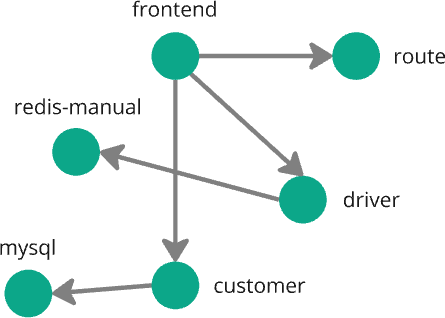
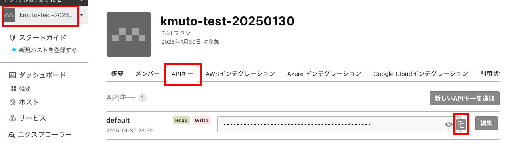
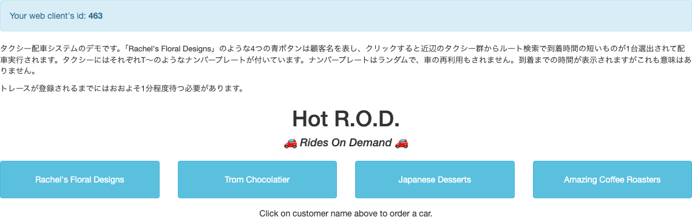
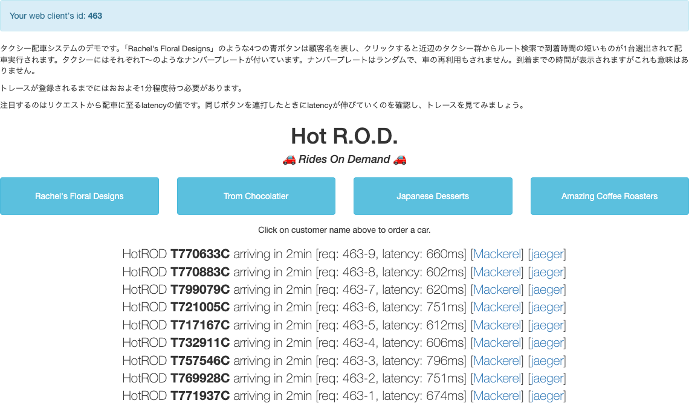

[←「OpenTelemetryとは」へ戻る](../04-opentelemetry/README.md)

# HotRODデモを使ってトレースシグナルを送ってみよう 〜デモ環境をDockerで構築する

いよいよ皆さんのコンピュータでアプリケーションを動かし、トレースシグナルをMackerelの分散トレーシング機能に送ってみます。

[GitとDockerの準備](../01-prepare/README.md)および[Mackerelのオーガニゼーションの準備](../02-mackerelsetup/README.md)は済んでいるでしょうか。

皆さん自身での計装のチャレンジは後半戦として、まずは計装済みの完成品で分散トレーシング機能でどのようなことがわかるのか、試していきます。

**HotROD**というデモを用意しました。

> [!NOTE]
> HotRODはOSSのトレーシングサービス「Jaeger」のサンプルデモですが、筆者がいくつか改造を施しています（[リポジトリ](https://github.com/kmuto/jaeger/blob/vaxila-demo/examples/hotrod/)）。

これは複数の**サービス**で構成される、架空のタクシー配車アプリケーションシステムです。

- フロントエンド
  - 顧客検索
    - MySQLサーバー（のダミー）
  - ドライバー検索
    - Redisサーバー（のダミー）
  - ルート検索



アプリケーションからはOpenTelemetry Collectorを経由して、Mackerelにトレースシグナルを送信します。このハンズオンでは、アプリケーションおよびOpenTelemetry Collectorはご利用のコンピュータのDocker上に構成します。また、TCPポートとして4318、8080、8081、8082、8083、8084を利用します。

## Gitリポジトリの展開

ターミナル上で、[https://github.com/mackerelio/mackerel-handson.git](https://github.com/mackerelio/mackerel-handson)からクローンしてください。

最初にターミナルでGitリポジトリを展開可能なフォルダ（たとえばホームフォルダ）に移動します。

```
cd (展開したいフォルダ)
```

`git`コマンドでGitリポジトリを展開します。

```
git clone https://github.com/mackerelio/mackerel-handson.git
```

これで、`mackerel-handson`というフォルダが作成され、ハンズオンのファイルが展開されます。

> [!NOTE]
> このハンズオンのドキュメント資料は、`mackerel-handson/tracing/docs`フォルダにあります。時間の都合で飛ばした内容の確認や、ハンズオンの復習にご活用ください。

> [!NOTE]
> 過去にGitリポジトリを展開済みで今回改めてご参加される方は、展開した`mackerel-handson`フォルダ内で`git checkout main`、`git pull`を実行して最新の状態にしておいてください。

## MackerelのAPIキーの取得とenv.txtファイルの変更

Mackerelのオーガニゼーションにトレースシグナルを送るための認証として、MackerelからAPIキーを取得し、OpenTelemetry Collectorに設定する必要があります。

MackerelのオーガニゼーションのAPIキーを取得するには、Mackerelのサイドメニューから左上のオーガニゼーション名をクリックし、さらに「APIキー」タブをクリックします。ここから新しいAPIキーを作ることもできますが、オーガニゼーションにはデフォルトで1つAPIキーが用意されているので、これを使えばよいでしょう。

APIキーの文字列はマスキングされていますが、コピーボタンをクリックすることで画面表示せずにコピーできます。



> [!NOTE]
> 目玉アイコンをクリックすると、APIキーを表示できます。

コピーしたAPIキーを`mackerel-handson/tracing/demo`フォルダ内の`env.txt`ファイルに書き込み、保存しましょう。

```
MACKEREL_APIKEY=
         ↓
MACKEREL_APIKEY=(APIキー文字列をペースト)
```

> [!IMPORTANT]
> `env.txt` の保存まで終わりましたか？

## Dockerの実行

では、Dockerコンテナを動かしてみます。

クローンした作業フォルダ内の`tracing/demo/hotrod`フォルダに移動してください（LinuxやmacOS、PowerShellの場合）。

```
cd mackerel-handson/tracing/demo/hotrod
```

Windowsの「コマンドプロンプト」では以下のようになります。

```
cd mackerel-handson¥tracing¥demo¥hotrod
```

ターミナルで以下を実行してください。

```
docker compose up
```

起動に成功すると、以下のように6つのコンテナが動きます。

```
[+] Running 6/0
 ✔ Container demo-hotrod-otel-collector-1  Running                            0.0s
 ✔ Container demo-hotrod-hotrod4-1         Running                            0.0s
 ✔ Container demo-hotrod-hotrod5-1         Running                            0.0s
 ✔ Container demo-hotrod-hotrod3-1         Running                            0.0s
 ✔ Container demo-hotrod-hotrod2-1         Running                            0.0s
 ✔ Container demo-hotrod-hotrod1-1         Running                            0.0s
 ```

> [!NOTE]
> 起動に失敗する場合、表示されるメッセージを確認してください。よくある理由としては、ポートを占有するコンテナあるいはアプリケーションがすでに起動していることです。

> [!NOTE]
> Dockerコンテナを終了したいときには、`docker compose up`を実行していたターミナルでCtrlキーを押しながらCキーを押して停止したあと、`docker compose down`を実行してください。Ctrl＋Cで停止しただけではまだコンテナが残っているため、`docker compose down`で消去します。

ブラウザで[http://localhost:8080](http://localhost:8080)にアクセスしてみましょう。次のような画面が表示されたでしょうか。



4つのボタンが表示されます。これらは顧客の名前を表しています。



クリックすると、近辺のタクシーの中から、ルート検索で到着時間の短いものが1台選ばれ、車のナンバー付きで配車されます。

あくまでもデモなので、車のナンバーや到着時間についてはさほど意味はありません。これからハンズオンを進めていく上で重要なのは「**latency**」で、これはリクエストからレスポンスまでの時間をミリ秒で示しており、ユーザー体験の重要な指標です。

> [!NOTE]
> 実際には高度なルート検索をしているわけではなく、相互の距離から時間を算出しているだけです。

> [!IMPORTANT]
> [http://localhost:8080](http://localhost:8080)に接続してHotRODの画面がブラウザで表示され、ボタンをクリックして反応があることを確認できましたか？

先ほどクリックしたことで、**トレースシグナルが生成され、Mackerelに送られています**。次はMackerelを見てみましょう。

[→「HotRODデモを使ってトレースシグナルを送ってみよう 〜送信したトレースをMackerelで見る」へ進む](../06-hotrod2/README.md)
