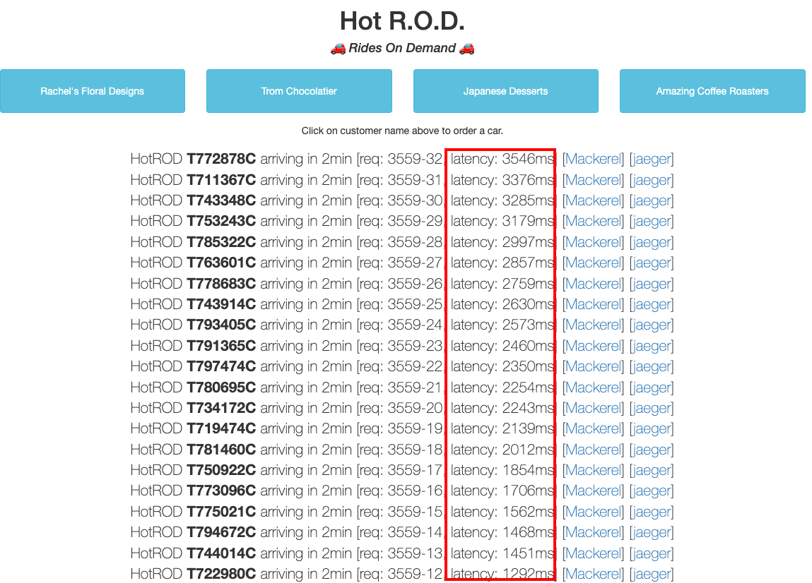
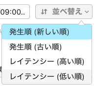
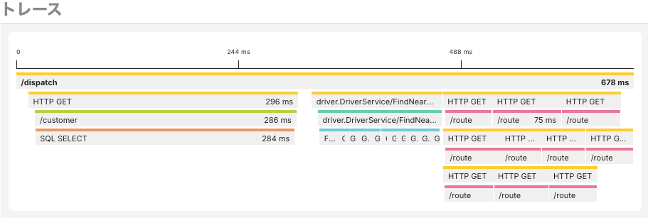
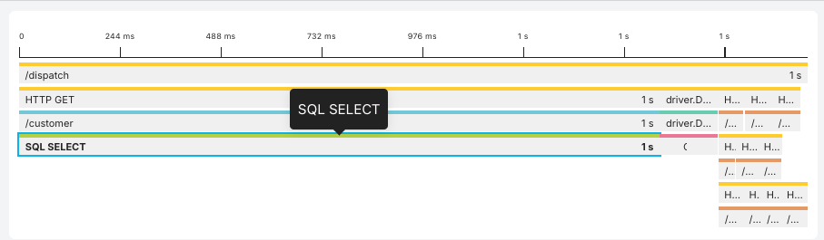
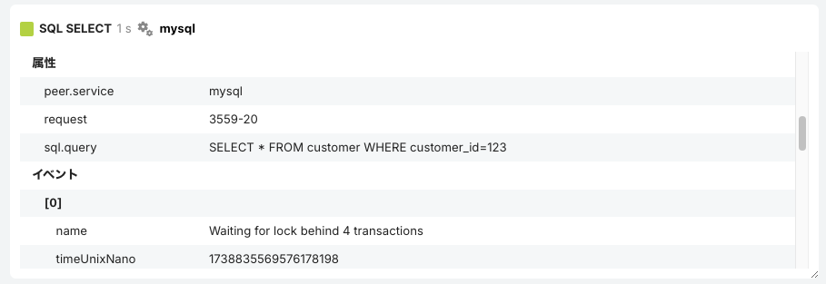
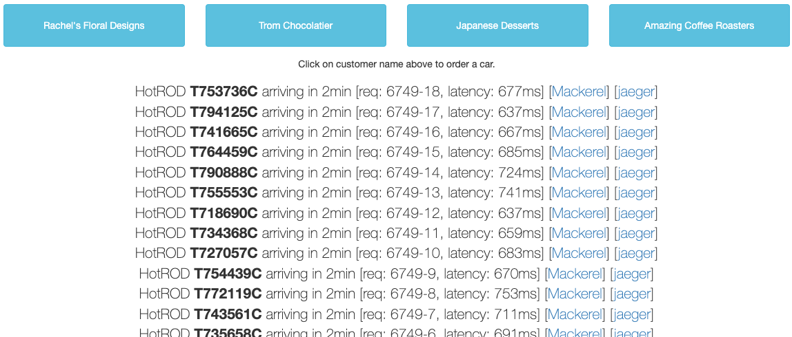
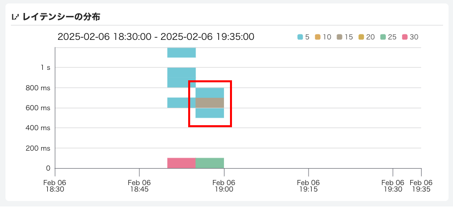
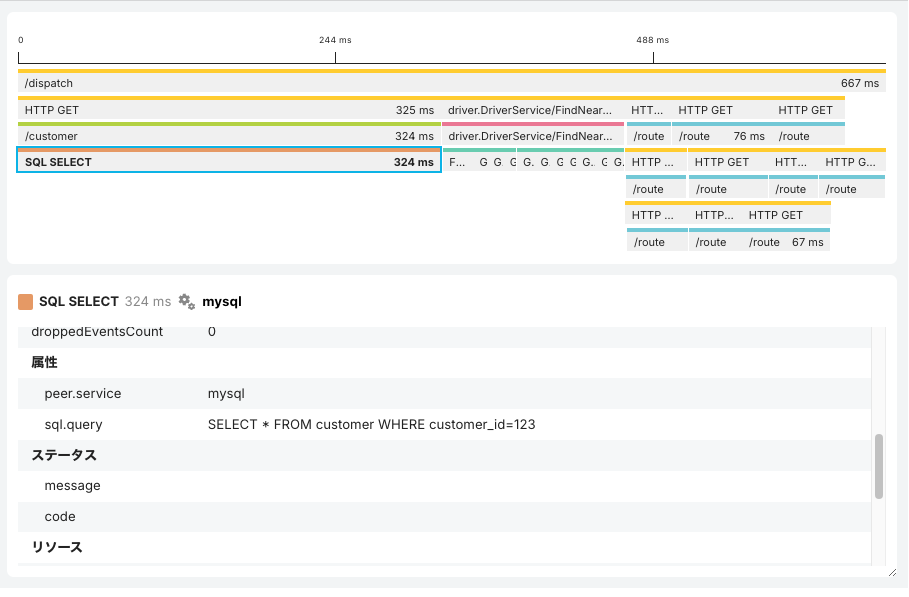

[←「HotRODデモを使ってトレースシグナルを送ってみよう 〜送信したトレースをMackerelで見る」へ戻る](../06-hotrod2/README.md)

# HotRODデモを使ってトレースシグナルを送ってみよう 〜レイテンシー悪化の原因を調査する

トレースの基本的な見方がわかったところで、アプリケーションの挙動の問題をトレーシング機能で見る体験に進みましょう。

今動かしているHotRODデモには、わざと複数の不具合を仕込んでいます。

## レイテンシーの悪化を引き起こす

[http://localhost:8080](http://localhost:8080)で動かしているHotRODの画面で、どれか1つのボタン、たとえば左の「Rachel's Floral Designs」ボタンを素早く連続でクリックしてみてください。

**latency**の値に注目してください。

連続してクリックすると、**線形的にどんどん処理時間が伸びていきます**。

これは明らかに**ユーザー体験が悪い**状況ですね！

> [!IMPORTANT]
> latencyの値に注目して、悪化していくことを確認できましたか？

## レイテンシー悪化の原因を調査する

メトリックによる監視の場合、レイテンシーの値をもとに「悪化した」というアラートを出すことは可能です。しかし、**なぜ**悪化に至ったのか調査するには、メトリックではたどれる情報が少なく、ベテランの経験と直感に頼ったり、仮説を立てて各サービスを1つずつ調べるという手段になりがちです。

これに対し、分散トレーシングでは、トレースを構成するスパンの状態を見て、**なぜ**にダイレクトに近づくことができます。

実行した時間帯に送信されたトレースのうち、レイテンシーが低いものと高いものを見比べてみましょう！

送信時間帯の期間をドラッグで選択します。

そして、「並び替え」の「**レイテンシー（低い順）**」を選んで、レイテンシーが低い（高速な）`/dispatch`トレースを別ウィンドウで開いてください。

次に、「並び替え」の「**レイテンシー（高い順）**」を選んで、レイテンシーが高い（低速な）`/dispatch`トレースを開いてください。

> [!IMPORTANT]
> 「並び替え」でレイテンシー順に並び換えて、レイテンシーが低いトレースと高いトレースを開けましたか？

2つのトレースを見比べると、**一目瞭然**でしょう。

レイテンシーが高いトレースでは、customerサービスから呼び出される`SQL SELECT`というデータベースクエリのスパンが大きく時間を消費しています。

`SQL SELECT`スパンの属性を見てみましょう。

クエリ自体はどちらも`SELECT * FROM customer WHERE customer_id=123`であり、徐々に遅くなるようなクエリには見えません。

> [!NOTE]
> `SELECT * FROM customer WHERE customer_id=123`は、顧客IDが123のすべてのデータを顧客データベースcustomerから抽出するというクエリです。

しかし、`SQL SELECT`スパンの属性をよく見ると、「イベント」の`name`属性に`Waiting for lock behind 4 transaction`（あるいは`Acquired lock; 3 transactions waiting behind`）のようにトランザクションのロック解除待ちになっていることが記録されています。

> [!IMPORTANT]
> トレースの`SQL SELECT`スパンをクリックし、属性とその値を見ることができましたか？

少々わざとらしいですが、アプリケーション側のコードにおいて、データベースの排他ロックを実行する際にはスパンの**ログ**として記録するように計装済みです。おかげで、何が原因なのかもこれでわかります。

データベースの排他ロックは、トランザクションの整合性を保つために使われます。しかし、ここで使っているのはごく単純な取得のクエリであり、そもそも排他ロックをすべきではありませんでした！

## レイテンシー悪化を修正し、確認する

原因がわかったので、アプリケーションのコードで排他ロックしないよう修正します。

……といっても、皆さんがここでコードを探し回る必要はありません。これはあくまでもダミーであり、修正したバージョンも用意済みです。

[http://localhost:8081](http://localhost:8081)をブラウザで開いてください。

画面に違いはありませんが、先ほどと同様に「Rachel's Floral Designs」ボタンを素早く連続してクリックしてみましょう。

いくらクリックしても、今度は安定したlatencyになっているはずです！

> [!IMPORTANT]
> latencyの値に注目して、悪化しなくなったことを確認できましたか？

Mackerelのトレースの一覧画面を開き、修正版のトレースを見てみましょう。

レイテンシーの分布では、一定のレイテンシーで安定していることがわかります。

`SQL SELECT`スパンが長くなることもなく、ロックに関するイベントも消えました。ほかのスパンも異常はなさそうです。

**適切な修正であるという確証を持てました！**

> [!IMPORTANT]
> `SQL SELECT`スパンからイベントがなくなっていることを確認できましたか？

経験と勘ももちろん大事ですが、アプリケーションやシステムで何が起きているのかの情報をトレースとして記録しておくことで、経験と勘に頼らずとも、原因を素早く推測できます。つまり、**オブザーバビリティ（可観測性）が高い状態となり、これまでに経験がないという症状であっても恐れずに立ち向かうことができます**！

次はパフォーマンス改善にトレーシング機能を利用してみましょう。

[→「HotRODデモを使ってトレースシグナルを送ってみよう 〜パフォーマンスを改善する」へ進む](../08-hotrod4/README.md)
