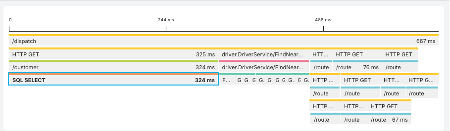
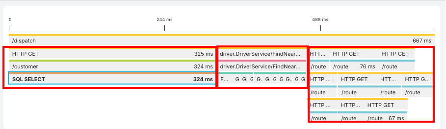
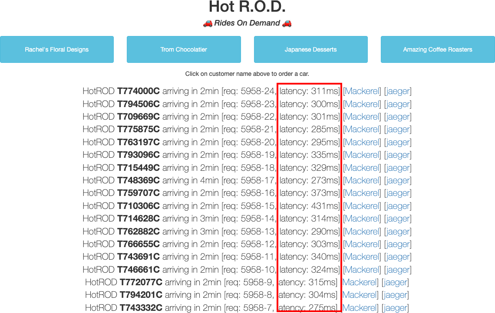
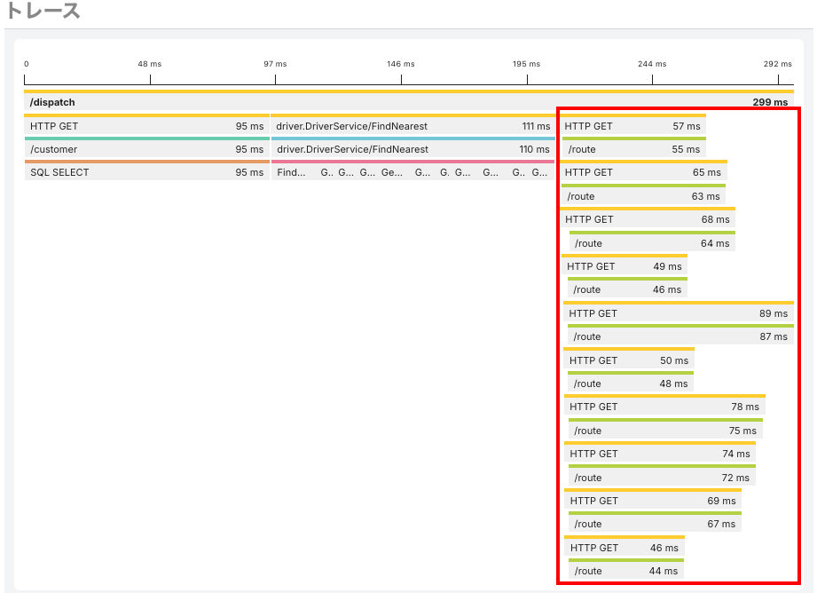

[←「HotRODデモを使ってトレースシグナルを送ってみよう 〜レイテンシー悪化の原因を調査する」へ戻る](../07-hotrod3/README.md)

# HotRODデモを使ってトレースシグナルを送ってみよう 〜パフォーマンスを改善する

`SQL SELECT`の改善が済んで、安定したレイテンシーにはなりました。

しかし、ユーザーから「アプリケーションのレスポンスが競合他社に比べてちょっと遅い」という問い合わせが複数届いています。皆さんには、**すぐに実現できて投資対効果の良いパフォーマンス向上策をとってほしい**という経営陣の指示が降りてきました。

どうしたらよいでしょうか？

## トレースから投資対効果の高い箇所を探す

先ほどの最後のトレースをもとに、投資対効果の高い箇所を探してみましょう。

> [!IMPORTANT]
> 先ほどの`SQL SELECT`の改善後のトレース画面を開いていますか？

HotRODアプリケーションは、大きく3つの処理に分けられます。

1. **顧客検索**：MySQLサーバーへのクエリ
2. **ドライバー検索**：Redisサーバーでの10台の選出
3. **ルート検索**：選ばれた10台についての距離検索

このうち、最初の**顧客検索**については3つの処理の中では最も時間がかかっている箇所ではあります。クエリの工夫など、チューニング次第では高速化できるかもしれませんが、すぐに実現できる見込みは立っていないか、あるいはこれ以上はコストがより高いインスタンスにする必要があり、ここへのテコ入れは選べないとします。

2つめの**ドライバー検索**については、3つの中では最も時間が短く、開発コストをかけても全体の時間から見て短縮の効果は大きくありません。スパンが直列（横方向）に並んでいることから順々に実行していることがわかり、これを並列化実行する（スパンとしては縦方向に並ぶ）ことで高速化できる可能性はあります。しかし、直列処理を並列処理に変えるのは時間も費用もかかる作業です。

3つめの**ルート検索**はどうでしょう。ここでは10台についてそれぞれルート検索するために最大**3つでの並列処理**を実行しています。並列処理を実行する数をもっと増やせれば、この箇所の処理時間はずっと短くなり、全体の処理時間も短縮できるはずです。

実はこの「3並列」であることに大きな意味はなく、開発当初に「なんとなく決めた」ことがわかりました。並列数をたとえば**100**に上げても、大きな問題はないという見積りもできています。

> [!NOTE]
> このアプリケーションはGo言語で書かれていますが、Goの並列実行は軽量で、並列数を設定するのも容易です。

> [!IMPORTANT]
> 3つの処理内容と、効果のありそうなポイントについて把握できましたか？

## 並列数を増やし、確認する

トレースをもとに修正ポイントがわかったので、アプリケーションのコード側でルート検索の並列実行数を3から100に修正します。

先ほどと同様、こちらも皆さんがここでコードを探し回る必要はありません。修正したバージョンを用意しています。

今度は[http://localhost:8082](http://localhost:8082)をブラウザで開き、ボタンを何回かクリックして、latencyの値を見てみましょう。

**ずっと速くなっています！**（この例では以前の半分の時間）

> [!IMPORTANT]
> [http://localhost:8082](http://localhost:8082)を開いてボタンをクリックし、latencyの値が下がったことを確認できましたか？

Mackerelのトレース画面でも確認してみましょう。

**レイテンシーの分布**で、レイテンシーが大幅に改善されたことが一目でわかります。

`/dispatch`トレースも見てみましょう。

ルート検索の**すべての処理が並列で実行されている**ことが、こちらも一目でわかりますね。

> [!IMPORTANT]
> レイテンシーの分布とトレースで、改善を確認できましたか？

アプリケーションのパフォーマンスが大幅に改善し、ユーザーは満足しているようです。

トレースはアプリケーションの一連のトランザクションを表現しています。コードやシステムを細かく調べる必要なしに、トレースを考察することで、**投資対効果の高い箇所を素早く見つけ出し、改善もビジュアライズできました**！

ハンズオンパートIのしめくくりとして、最後はサービス内でエラーが発生したときの解析をしてみましょう。

[→「HotRODデモを使ってトレースシグナルを送ってみよう 〜エラーの原因の解析」へ進む](../09-hotrod5/README.md)
