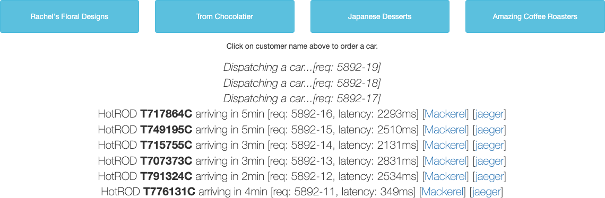
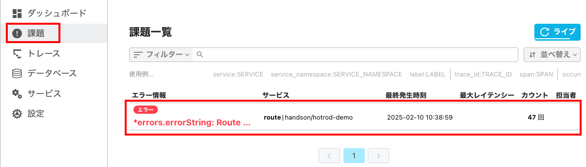
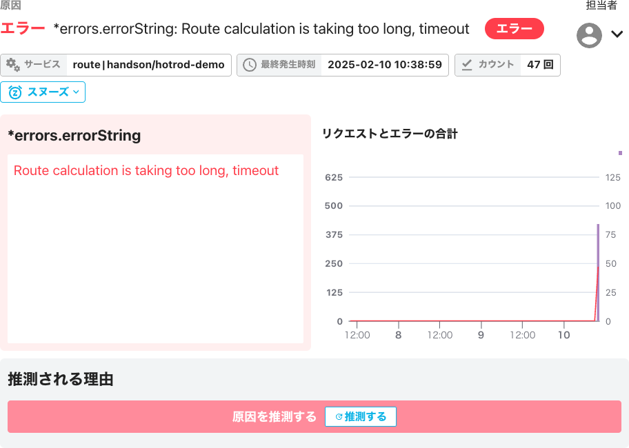
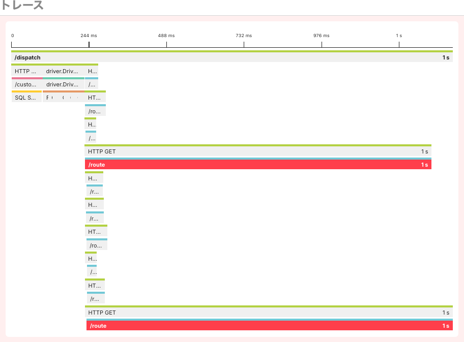
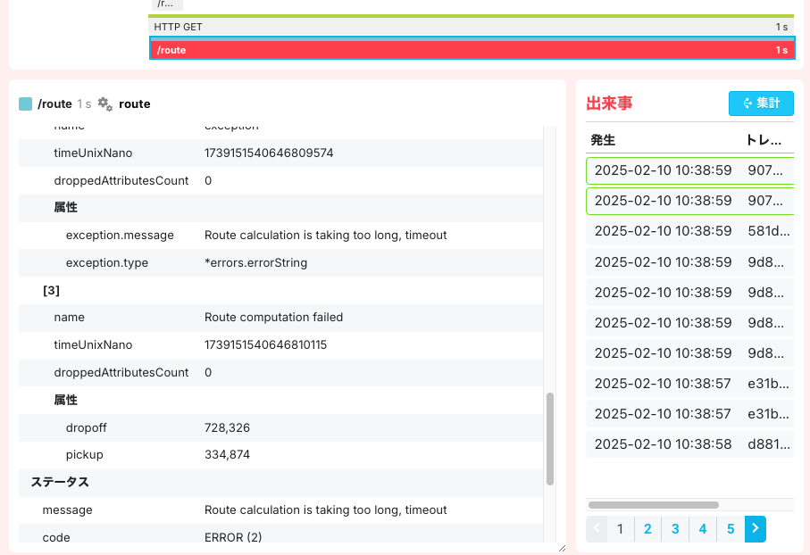
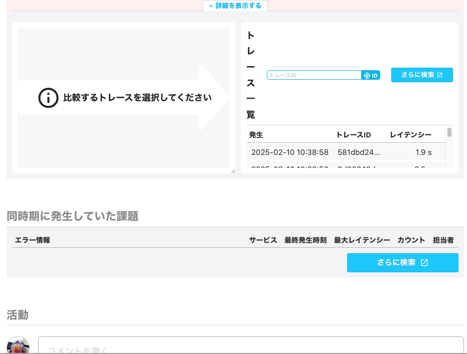

[←「HotRODデモを使ってトレースシグナルを送ってみよう 〜パフォーマンスを改善する」へ戻る](../08-hotrod4/README.md)

# HotRODデモを使ってトレースシグナルを送ってみよう 〜エラーの原因の解析

レイテンシー悪化の原因、パフォーマンス改善ポイントの発見、と見てきました。最後に、分散トレーシングを使った、アプリケーションの障害の解析をやってみましょう。

エラーや例外をアプリケーションが捕捉したときに、その**エラーログ**をスパンの情報に含めておくと、トレース内のどのスパンでエラーが発生し、その理由がなぜかを簡単に特定できるようになります。これは「特定の状況だけ起きる」といった本番ならではの障害を解析するときの助けになります。

## アプリケーションのエラーを引き起こす

今度は[http://localhost:8083](http://localhost:8083)にブラウザでアクセスしてください。

何度かボタンをクリックしていると、何か詰まるような動作が発生します。ときには「`Dispatching a car ...`」から結果が返ってこないことさえあるかもしれません。最初のデータベースの排他ロックのときとは違い、連続でクリックしてみたり、ボタンをいろいろ選んでみたりといった操作でも、ブラウザ側からは傾向はわかりませんが、何かおかしいのは確かです。

> [!IMPORTANT]
> [http://localhost:8083](http://localhost:8083)を開いてボタンをクリックし、ときどき詰まるような動きを確認できましたか？

## Mackerelの「課題」を見る

Mackerelの画面に行き、今回はいつもの「トレース」ではなく、サイドメニューから「課題」を選びます。これで、「**課題一覧**」画面が開きます。

> [!NOTE]
> 「フィルター」ボタンからは「今日発生」、「自分に割り当て」、「フィルター条件」で課題のフィルターを設定できます。「ライブ」は課題一覧の自動リロードの有無の設定です（クリックすると自動リロードをしなくなります）。

課題一覧には、次のようなエラー情報が記録されているはずです。

> [!IMPORTANT]
> 「課題」メニューから「課題一覧」画面を開いてみたときに、エラー情報が入っていますか？

- 「`*errors.errorString: Route calculation is taking too long, timeout`」：「エラー」というマークが付いています。これは、そのスパンがエラーの直接の原因であることを意味します。

`Route calculation is taking too long, timeout`はスパンのエラーログに入っていた文字列です。「ルート計算に時間がかかりすぎ、タイムアウトしてしまった」ということですね。

サービスも`route | handson/hotrod-demo`となっており、routeサービスの中で問題が起きたことは明らかです。

> [!NOTE]
> サービスの外部への呼び出し起因（たとえばRedisサーバーへのアクセスの失敗など）でエラーになったときには、「クライアントエラー」というマークになります。

では、課題「`*errors.errorString: Route ...`」をクリックしましょう。すると、課題の詳細が表示されます。

- **サービス**：サービス名・サービスネームスペースが表示されています。
- **最終発生時刻**：同じ種類のエラーのうち、直近で発生していた時刻です。
- **カウント**：直近の発生カウント数です。
- **担当者**：このエラーの調査や対応を特定のオーガニゼーションメンバーに割り当てることができます。
- **スヌーズ**：エラーの通知を一定期間あるいは無期限に停止します。トレース自体の受け付けを止めるものではありません。
- **推測される理由**：トレースのスパンの属性値をもとに原因を推測し、提案します。現時点ではまだ精度に問題がありますが、状況によっては役立つ解を得られるかもしれません。

> [!NOTE]
> 現時点では、「担当者」を設定した場合、オーガニゼーションのほかのユーザーに切り替えることはできますが、担当者なしの状態に戻すことはできません。

エラーの詳細と、リクエストとエラーの合計グラフも示されています。

> [!IMPORTANT]
> 課題をクリックし、詳細が表示されましたか？

さらに下を見ていきましょう。

`/route`スパンが**赤く表示されています**。これは、10個並列実行されるルート検索のうち、複数でエラーが起きていることを示しています。

通常のトレース詳細とほぼ同じで、スパンをクリックするとその属性を表示できます。

右側の「出来事」では、直近の同種のエラーを含むトレースが一覧されており、クリックしてそのトレースを確認できます。

> [!NOTE]
> 属性の領域が狭いときには、右下の角をドラッグして縦横に広げられます。

> [!IMPORTANT]
> `route`スパンをクリックして、属性とその値が表示されましたか？

さらに下には、既存のほかのトレースと比較するメニューや、同時期に発生していた課題（エラー）、それにこの課題に対応しているメンバーのコメント記入欄が用意されています。

## 課題から推察する

詰まる原因は、routeサービスで発生した長すぎるルート検索によるタイムアウトであることが、課題に現れたメッセージから一目でわかりました。

スパンの処理の内部で処理エラーが発生したときに、属性値やその中の**イベント**（エラーのような特定の出来事）の形で、そのスパンをエラーを含むものとして特別扱いできます。

Mackerelのような分散トレーシングはトレース内のスパンにあるこのエラー情報を拾い、画面上で示したり、通知したりします。Mackerelの場合はこれが「課題」に出てくるというわけです。

> [!NOTE]
> Mackerelの場合、現時点では、「エラーステータスコード」だけではなく、「エラーイベント」も作成しないとエラー扱いにならず、課題にも現れません（ほかの分散トレーシングではエラーになるのが一般的なので、今後挙動が変わる可能性があります）。特にゼロコード計装の場合、エラーイベントが作成されないことがあるので、必要に応じて手動で計装する必要があります。

ここで、`Route calculation is taking too long, timeout`というログメッセージは、アプリケーションのルート検索のコードでこのようなエラーが発生する可能性を想定して書き出すように実装されていました。

さらに調査にあたって便利な情報は、トレースとスパンの属性から得られます。

- トレースには、発生した時刻とレイテンシーが入っています。
- ルート検索（`/route`）が必要とする値は、乗車地点（`pickup`）・降車地点（`dropoff`）の2つだけです。この情報が`/route`スパンの属性値として含まれています。
- `/route`スパンの属性には、ホスト名（`host.name`）などのリソースの情報が含まれています。
- `/dispatch`スパンでは、顧客ID（`customer_id`）が属性値として入っています。

アプリケーション開発者にとって、これらの情報があれば、特定の状況で起きるエラーを再現し、解決するのに大いに役立ちます。

**アプリケーションサービス内でエラーが発生したときに、発生箇所がすでに特定されており、状況を再現するのに十分な情報も得られることがわかりました！**

> [!IMPORTANT]
> トレースとスパンの属性に、アプリケーション開発者に便利そうなさまざまな情報が含まれていることを確認できましたか？

## 種明かし

このハンズオンの範囲としては**原因究明に十分な情報を得られた**ということで終わりですが、エラーが発生した**真の原因**は何だったのか、気になる方もいらっしゃると思うので種明かしをしておきましょう。

アプリケーション開発者は`Route calculation is taking too long, timeout`というメッセージを発生させるルート検索サービスのコードを確認しました。ルート検索サービスでは、乗車地点（`pickup`）と降車地点（`dropoff`）の間の所要時間をルート検索します。このとき、地点間の距離が長いと、計算を所定時間内に解決できないことがわかりました。これがエラーの原因です。

このアプリケーションでは10台の候補から所要時間が最適なものを探すので、解決できないほど距離が長い数台について選択される可能性は除外できます。そのため、アプリケーション開発者は、最初に地点間の距離を直線距離で概算し、一定値を超えるものについてはルート検索をせずに候補から落とすように変更しました。これで、アプリケーションの動作は正常になりました。

> [!NOTE]
> ハンズオンのアプリケーションのコードは一部ダミーなので、実際にこのとおりになっているわけではありません。

[→「ここまでのまとめ」へ進む](../10-hotrod-summary/README.md)
