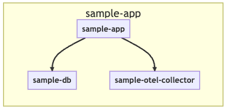
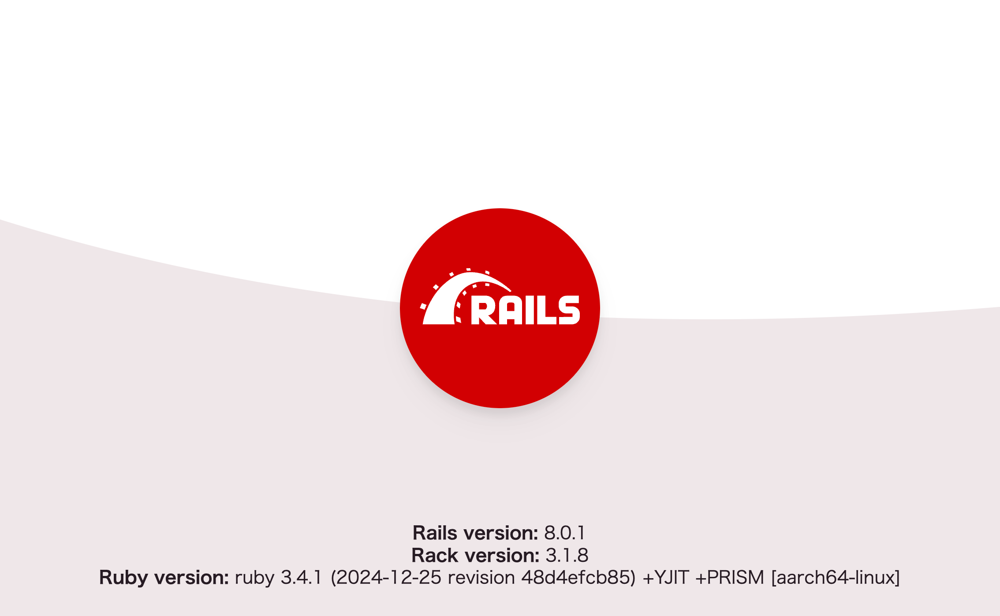

# トレースを用いてWebアプリケーションを改善してみよう 〜サンプルWebアプリケーションの準備

## 構成



以下の3つのコンテナが、コンテナ環境で立ち上がります。

- sample-app: Ruby on Railsで書かれたWebアプリケーション
- sample-db: データ保存先のPostgreSQL
- sample-otel-collector: OpenTelemetry Collector

HotRODの例と同様に、アプリケーションで計装されたトレースはOpenTelemetry Collectorで受信され、Mackerelに送信されます。

## 実行環境

アプリケーションは、先のハンズオンと同様にDocker上で実行します。まずはターミナル上で[`demo/sample-app/ruby`](../../demo/sample-app/ruby)フォルダに移動しましょう。

```shell
cd mackerel-handson/tracing/demo/sample-app/ruby
```

先ほどのHotRODを実行していたターミナルであれば、以下のように移動できます。

```shell
cd ../sample-app/ruby
```

## APIキーの設定

APIキーは、[MackerelのAPIキーの取得とenv.txtファイルの変更](../05-hotrod1/README.md#mackerelのapiキーの取得とenvtxtファイルの変更)で設定済みです。もし、ハンズオンの後半から始めている場合は手順に従って設定してください。

## アプリケーションのビルドとデータベースの初期化

アプリケーションを起動する前に、ビルドとデータベースの初期化を行います。ターミナルから以下のコマンドを実行し、データベースの初期化と初期データの登録をしてください。なお、アプリケーション用コンテナのビルドも同時に行われます。**この処理にはしばらく時間がかかります**。

```shell
docker compose run --rm app bin/rails db:prepare
```

コマンドの実行に成功すると、以下のようにコンテナのビルドとデータの登録が行われます。

```shell
05:13 ❯ docker compose run --rm app bin/rails db:prepare
[+] Running 19/19
 ✔ otel-collector Pulled                                                         7.8s
   ✔ 32e897be644b Pull complete                                                  1.2s
   ✔ 9ef1b8b02f2f Pull complete                                                  3.7s
   ✔ b4920bb24330 Pull complete                                                  3.7s
 ✔ db Pulled                                                                    12.8s
   ✔ 4d2547c08499 Already exists                                                 0.0s
   ✔ 3573814a3a24 Pull complete                                                  2.2s

(snip)

   ✔ 64efff9847b7 Pull complete                                                  8.7s
[+] Creating 3/3
 ✔ Network ruby_sample-app          Created                                      0.1s
 ✔ Container sample-otel-collector  Created                                      0.2s
 ✔ Container sample-db              Created                                      0.2s
[+] Running 2/2
 ✔ Container sample-otel-collector  Started                                      0.2s
 ✔ Container sample-db              Started                                      0.2s
[+] Building 2.2s (13/13) FINISHED                               docker:desktop-linux
 => [app internal] load build definition from Dockerfile                         0.0s
 => => transferring dockerfile: 266B                                             0.0s
 => [app internal] load metadata for docker.io/library/ruby:3.4.1-slim           1.8s

(snip)

 => => naming to docker.io/library/ruby-app                                      0.0s
 => [app] resolving provenance for metadata file                                 0.0s
Created database 'sample_development'
Created database 'sample_test'
```

> [!IMPORTANT]
> 以下の2行が表示され、処理が完了していれば初期化は成功です。
> ```shell
> Created database 'sample_development'
> Created database 'sample_test'
> ```

## アプリケーションの起動

準備が整ったので、Docker Composeでアプリケーションを動かしましょう。ターミナルで以下のコマンドを実行してください。

```
docker compose up
```

起動に成功すると、以下のように3つのコンテナが動作します。

```shell
$ docker compose up
[+] Running 3/3
 ✔ Container sample-db              Running                            0.0s
 ✔ Container sample-otel-collector  Running                            0.0s
 ✔ Container sample-app             Created                            0.1s
Attaching to sample-app, sample-db, sample-otel-collector
sample-app             | => Booting Puma
sample-app             | => Rails 8.0.1 application starting in development
sample-app             | => Run `bin/rails server --help` for more startup options
sample-app             | I, [2025-02-12T01:15:40.272611 #1]  INFO -- : Instrumentation: OpenTelemetry::Instrumentation::ActiveSupport was successfully installed with the following options {}

(snip)

sample-app             | I, [2025-02-12T01:15:40.282211 #1]  INFO -- : Instrumentation: OpenTelemetry::Instrumentation::Rails was successfully installed with the following options {}
sample-app             | Puma starting in single mode...
sample-app             | * Puma version: 6.6.0 ("Return to Forever")
sample-app             | * Ruby version: ruby 3.4.1 (2024-12-25 revision 48d4efcb85) +YJIT +PRISM [aarch64-linux]
sample-app             | *  Min threads: 3
sample-app             | *  Max threads: 3
sample-app             | *  Environment: development
sample-app             | *          PID: 1
sample-app             | * Listening on http://0.0.0.0:3000
sample-app             | Use Ctrl-C to stop
```

> [!NOTE]
> 起動に失敗する場合は、表示されるメッセージを確認してください。よくある原因として、ポートを占有しているコンテナまたはアプリケーションがすでに起動していることが考えられます。

ブラウザで[http://localhost:3000](http://localhost:3000)にアクセスすると、Ruby on Railsのデフォルトページが表示されるはずです。



これで準備が整いました。

[→「トレースを用いてWebアプリケーションを改善してみよう 〜OpenTelemetryによる計装」へ進む](../13-instrumentation/README.md)
