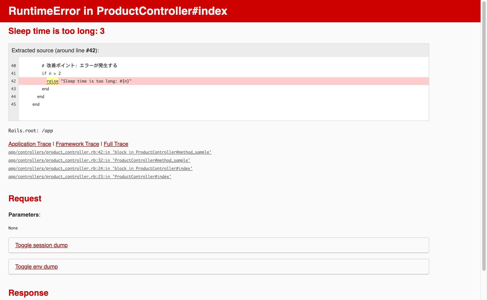
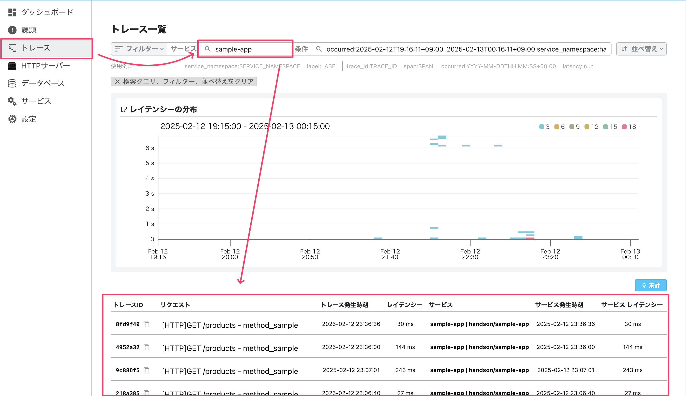

# トレースを用いてWebアプリケーションを改善してみよう 〜Mackerelでトレースを確認しよう

今回扱うアプリケーションでは、多数の商品（Product）が登録されており、各商品のそれぞれにカテゴリ（Category）が設定されています。商品の一覧を取得するエンドポイントに様々な問題があるため、トレーシング機能を活用して改善していこうというシナリオです。

まず、ブラウザで[http://localhost:3000/products](http://localhost:3000/products)にアクセスしてみましょう。

しばらくすると、このような画面が表示されるはずです。これはRuby on Railsが開発用に表示するエラー画面です。この画面からも改善の情報は得られますが、開発用のものなので本番環境ではエラーの発見や原因の特定に使うことはできません。そのような場合に役立つのがトレーシング機能やそれを内包するAPM（アプリケーションパフォーマンスモニタリング）の機能です。



> [!NOTE]
> この画面が表示されない場合は、アプリケーションの初期化や起動に失敗している可能性があります。[サンプルWebアプリケーションの準備](../12-prepare-webapp/README.md)をご参照ください。

> [!NOTE]
> ターミナルに以下のようなエラーが表示されている場合、トレースの送信に失敗しています。[env.txtファイル](../../demo/env.txt)にMackerelのAPIキーが正しく設定されているか確認してください。
>
> ```shell
> sample-otel-collector  | 2025-02-12T01:13:26.963Z       error   internal/queue_sender.go:84     Exporting failed. Dropping data.        {"kind": "exporter", "data_type": "traces", "name": "otlphttp/mackerel", "error": "not retryable error: Permanent error: rpc error: code = InvalidArgument desc = error exporting items, request to https://otlp-vaxila.mackerelio.com/v1/traces responded with HTTP Status Code 400, Message=Invalid API Key, Details=[]", "dropped_items": 8}
> ```

エンドポイントのレスポンスタイムやこのエラーの改善の手がかりを探るため、Mackerelに送信されたトレースを確認してみましょう。

HotRODのトレースを確認した際と同様に、MackerelのWebコンソールのサイドメニューから「トレース」をクリックしてトレース一覧画面を表示します。サービス欄に`sample-app`と入力すると、このサービスに関連するトレースの一覧が確認できます。



リクエストが`GET /products`で始まるトレースを選択するとトレースの詳細が確認できます。この画面をもとに、アプリケーションの改善を進めましょう！

[→「トレースを用いてWebアプリケーションを改善してみよう 〜シナリオ1」へ進む](../15-scenario1/README.md)
