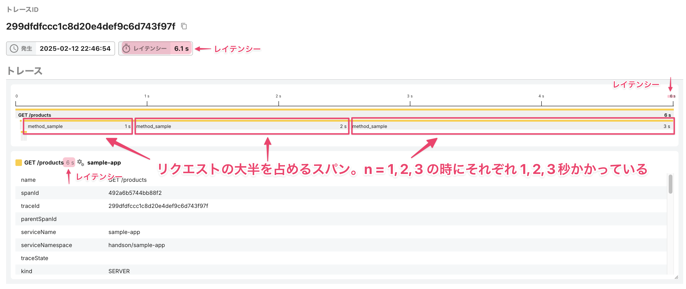
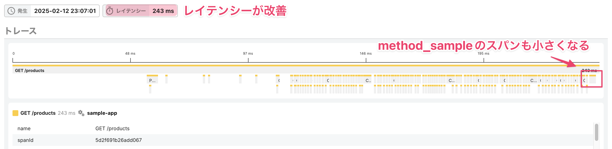

# トレースを用いてWebアプリケーションを改善してみよう 〜シナリオ2

`/products`エンドポイントはレイテンシーが6秒前後かかっているためこれを改善してみます。リクエストの一連の処理の中でどこに時間がかかっているでしょうか。トレースを確認してみます。

横幅が長いスパンはトレース全体の中で相対的に処理に時間がかかっているものです。長いスパンに着目すると`method_sample`という名前のスパンが3つあり、どれも処理に1秒以上かかっている事がわかります。



`code.function`、`sleep.time`といった属性を見ると、これは最初に見た[手動計装](../13-instrumentation/README.md#スパンを作るコードを書くことによる手動計装)によって計装したスパンである事がわかります。この属性はコードの以下の部分で設定しています。今回はメソッド名や引数の値などを設定していますが、課題の発見や解決、集計の切り口となるような属性を設定するとよいでしょう。

```ruby
span.set_attribute(OpenTelemetry::SemanticConventions::Trace::CODE_FUNCTION, __method__.to_s)
span.set_attribute('sleep.time', n)
```


処理に時間がかかっているメソッドの特定ができたので改善をします。以下のように`sleep`する時間を0にして保存したら、再び[http://localhost:3000/products](http://localhost:3000/products)にアクセスしてみましょう。ブラウザアクセスの時点でレスポンスがすぐに返ってくる事が体感できるはずです。

修正前: `n`秒スリープする

```ruby
sleep(n)
```

修正後: スリープしない

```ruby
sleep(0)
```

トレースを確認し、ブラウザアクセスで得た体感がトレースのデータに表れているかを確認します。 大きな割合を占めていた`method_sample`のスパンが小さくなりトレース全体のレイテンシーが大きく改善された事が確認できます。



スパンが表示されている領域をドラッグすることで拡大ができます。


一方で、これまで相対的に小さく、目立っていなかったスパンがたくさんあることがわかります。次はこのスパンの原因を見ていきます。

[→「トレースを用いてWebアプリケーションを改善してみよう 〜シナリオ3」へ進む](../17-scenario3/README.md)
