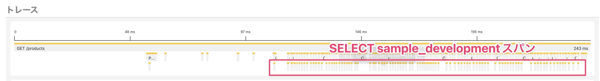
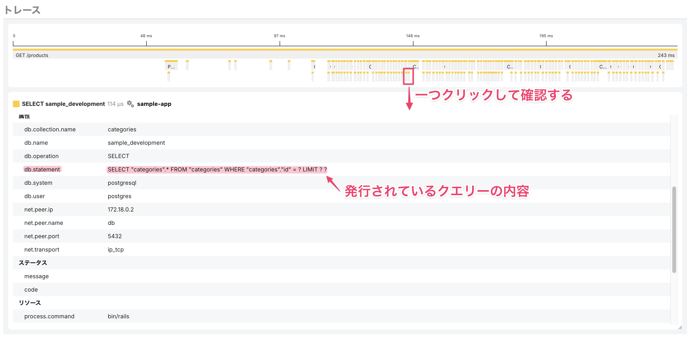
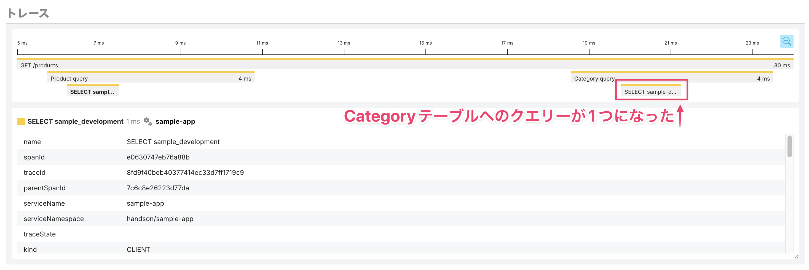
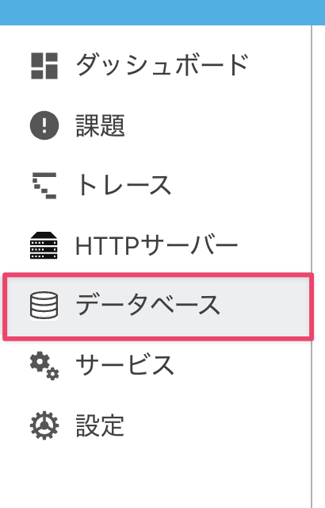
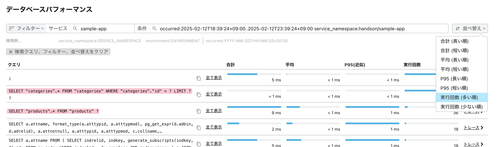

# トレースを用いてWebアプリケーションを改善してみよう 〜シナリオ3

小さなスパンがたくさんあるのは、どういう事が起きているでしょうか。一番子となっている下側のスパン（最終的な処理）に着目します。



全てが`SELECT sample_development`という名前になっており、この中の一つをクリックしてみて`db.statement`属性に着目すると以下のSQLを発行している事がわかります。

```sql
SELECT "categories".* FROM "categories" WHERE "categories"."id" = ? LIMIT ? ?
```



他の`SELECT sample_development`スパンを確認しても同じ様子で、同一のテーブルから1件ずつデータを引く処理が大量にあり、いかにも効率が悪そうです。実際にコードを見ていきましょう。

[`app/controllers/product_controller.rb`](../../demo/sample-app/ruby/app/controllers/product_controller.rb)見ると`products.map`の部分でループをするたびに`product.category.name`にアクセスしCategoryテーブルからデータを引いているため、典型的なN+1問題が起きていそうです。この処理を改善しましょう。

```ruby
products = Product.all.sample(100)

...snip...

results = products.map do |product|
  {
    product: product.name,
    prirce: product.price,
    description: product.description,
    category: product.category.name,
  }
end
```

> [!NOTE]
> N+1問題とは、データベースからデータを取得する際、N個のデータに対してN+1回のクエリが発行されることで発生する非効率な処理パターンを指します。最初の1回のクエリでN個のデータを取り出し、その後、N個のデータそれぞれに対して追加のクエリを実行するため、合計でN+1回のクエリが必要になります。この問題は、Webアプリケーションのパフォーマンス低下を引き起こす原因となります。

改善の方法はライブラリやフレームワークによってさまざまなため、今回はRails（ActiveRecord）の機能を用いた改善案をあらかじめコメントとして記載してあります。

`products = Product.all.sample(100)`の先頭に`#`をつけコメントアウトし、`# products = Product.includes(:category).all.sample(100)`から`#`を削除して保存します。

修正後: ActiceRecordの機能によってProductに紐づくすべてのCategoryのをあらかじめ取得しておく

```ruby
#products = Product.all.sample(100)
products = Product.includes(:category).all.sample(100)

...snip...

results = products.map do |product|
  {
    product: product.name,
    prirce: product.price,
    description: product.description,
    category: product.category.name,
  }
end
```

再び[http://localhost:3000/products](http://localhost:3000/products)にアクセスしてみましょう。たくさんあった`categories`テーブルへのクエリが以下のようなひとつのクエリにまとまった事が確認できます。

```sql
SELECT "categories".* FROM "categories" WHERE "categories"."id" IN (?, ?, ?, ?, ?, ?, ?, ?, ?, ?, ?, ...snip... , ?) ?
```



これでN+1問題を改善する事ができました。

実際の運用では、エンドポイントのトレースのレイテンシーが悪くない場合はトレースを起点にN+1問題を発見するということは少ないかもしれません。データベースへのクエリーに関する問題の発見には、サイドメニューの「データベース」にあるデータベースパフォーマンスのページが役に立ちます。



このページではクエリーの処理時間や実行回数といった切り口でデータベースアクセスのパフォーマンスを確認する事ができます。「実行回数 (多い順)」を選択すると先ほどのクエリーが上位にある事がわかり、そのクエリーのスパンを含むトレースへリンクされているので、どのトレースでクエリーが発行されているかがわかります。



> [!NOTE]
> Mackerelのトレーシング機能では、データベースのセマンティック規約に則ったクエリー（`db.statement`、`db.query.text`）が集計されます。規約に則っていればRDBだけでなく、MongoDBやAmazon DynamoDBといったNoSQLデータベースのパフォーマンスも集計されます。

[→「トレースを用いてWebアプリケーションを改善してみよう 〜まとめ」へ進む](../18-wrapup/README.md)
